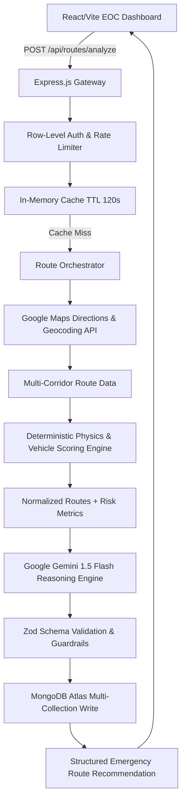

# RapidPath System Architecture

## 1. Executive Summary

**RapidPath** is an AI-powered emergency vehicle routing system engineered to optimize life-critical response times. Rather than simply routing along the shortest geographical distance, RapidPath evaluates real-time Google Maps directions, traffic congestion levels, vehicle physics profiles (Ambulance, Fire Engine, Police Interceptor, Rescue Unit), deterministic reliability scores, and Google Gemini AI multi-factor reasoning.

---

## 2. Layered Backend Architecture

The backend adheres strictly to a clean, layered architectural pattern:

- **Controllers** (`server/src/controllers/`): HTTP lifecycle handling, parameter extraction, and status codes.
- **Middleware** (`server/src/middleware/`): Helmet, CORS, API rate limiting, structured Winston request logging, and global error isolation.
- **Services** (`server/src/services/`):
  - `maps/`: Google Maps Platform integration with automatic geospatial fallback generator.
  - `scoring/`: Deterministic multi-factor scoring algorithms and emergency vehicle weightings.
  - `gemini/`: Official Google Gemini SDK client with retry policy, timeout handling, strict JSON schema parsing, and deterministic synthesis fallback.
  - `routing/`: Route orchestration, in-memory TTL caching, and MongoDB persistence.
- **Models** (`server/src/models/`): Mongoose schemas with indexed user scoping, timestamps, and relational references.
- **Validators** (`server/src/validators/`): Zod schemas for all request payloads, history queries, and Gemini outputs.

---

## 3. Deterministic Scoring Algorithm

The core premise of RapidPath is that AI reasoning must be anchored by explainable, deterministic algorithms:

$$\text{Composite Score} = (S_{\text{time}} \times W_t) + (S_{\text{traffic}} \times W_c) + (S_{\text{risk}} \times W_r) + (\text{Reliability} \times W_{\text{rel}})$$

- **Reliability Index ($\%$):** Deducts points for high traffic delay ratios and active disruption hazards:
  $$\text{Reliability} = 100 - (\text{DelayRatio} \times 45 \times P_{\text{vehicle}}) - (\text{HazardPenalties} \times 0.7)$$
- **Emergency Suitability ($/100$):** Weighs vehicle speed capabilities against bottlenecks. Heavy apparatus (e.g. fire engines) receive stricter penalties for congested corridors.

---

## 4. Security & Safety Principles

1. **Server-Side Key Isolation:** Gemini API keys and Google Maps Server keys exist only in server environment variables.
2. **Untrusted AI Handling:** Every Gemini response is parsed and passed through Zod schema validation before entering the application domain.
3. **No Hallucinated Incidents:** Gemini system prompts explicitly prohibit the generation of fictional accidents or real-world events.
4. **Data Isolation:** Queries enforce row-level scoping based on verified operator credentials (`userId`).
